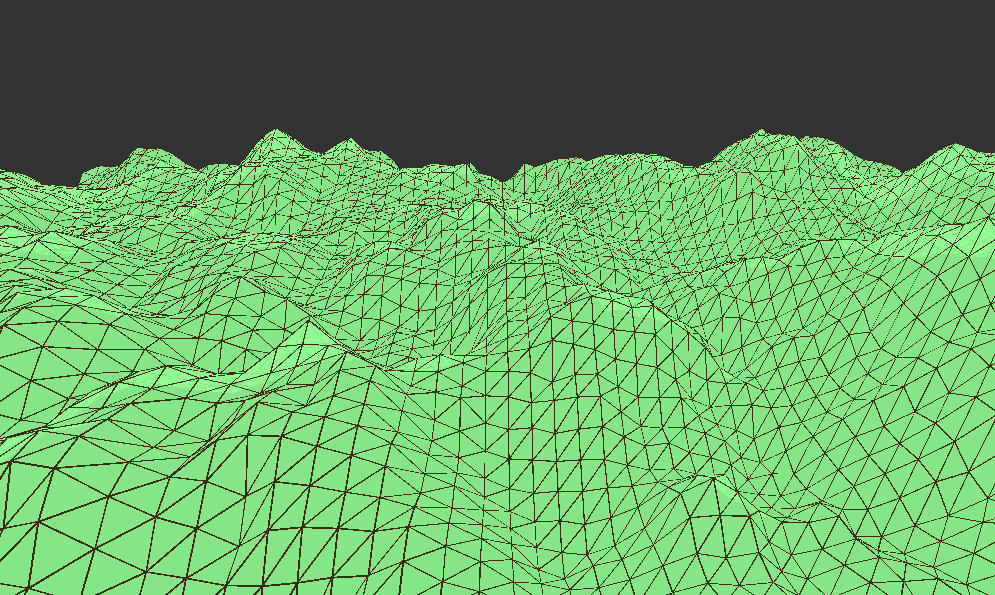

# Terrain Generator

Generates a terrain using Perlin noise, using the P5js library. Can be run using the `live-server` package. 

### Disclaimer

This was not my original idea. I watched [this video by The Coding Train]() and applied what I learned. 

